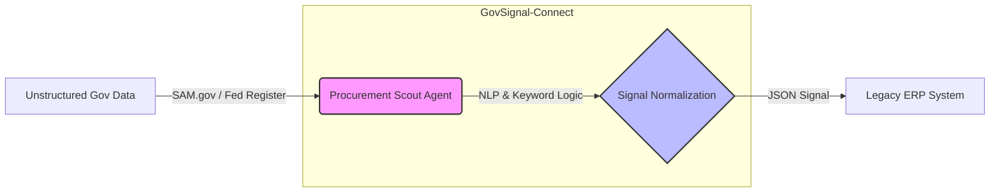

# GovSignal-Connect: Autonomous Procurement Signals for Legacy ERPs via Federal Data Feeds

**Reference Implementation for the "Smart Overlay" Architecture**

## 1. Overview
GovSignal-Connect is a technical proof-of-concept demonstrating how autonomous agents can bridge the "Inventory Lag" gap in critical industries.

Legacy ERP systems (SAP, Oracle) are historically reactive—optimizing inventory based on past consumption or committed orders. In high-volatility sectors like Defense and Semiconductors, this reactivity leads to supply shortages during rapid policy shifts (e.g., CHIPS Act funding or sudden DoD solicitations).

This "Strategic Procurement Agent" (The Scout) acts as a predictive layer. It continuously monitors unstructured government data streams (SAM.gov, Federal Register), normalizes them into structured "Signals," and feeds them into legacy ERPs to trigger pre-emptive capital release.

## 2. Use Cases

This prototype demonstrates two specific high-value scenarios:

### Case A: Semiconductor Supply Chain
- **Trigger**: The Federal Register publishes a "CHIPS Act Funding Opportunity" for domestic nanofabrication.
- **Signal**: The Scout detects the grant, correlates it with "Nanofabrication," and predicts a demand spike for specific assets.
- **Action**: A signal is sent to the ERP to "Release Capital Hold" for **High-Vacuum Chambers**, securing long-lead inventory before market saturation.

### Case B: Defense Industrial Base
- **Trigger**: SAM.gov lists a "DoD Solicitation" for "Electronic Warfare Readiness."
- **Signal**: The Scout identifies "Jamming Pods" requirements.
- **Action**: Immediate recommendation to increase stock levels for **TWT (Traveling Wave Tube) Amplifiers**, a critical sub-component for EW systems.

## 3. Architecture



## 4. Technical Implementation

This repository contains:
- `govsignal/scout.py`: The core agent implementing the surveillance loop and demand probability scoring.
- `govsignal/connectors.py`: Mock adapters for federal APIs (simulating API responses for demonstration).
- `examples/config.yaml`: Configuration defining the surveillance targets and keyword ontologies.

### Running the Prototype

**Prerequisites:**
- Python 3.10+
- `uv` package manager (recommended) or standard pip.

**Setup:**
1. Initialize the environment:
   ```powershell
   setup_env.bat
   ```

**Execution:**
1. Run the Scout agent:
   ```powershell
   run_scout.bat
   ```
2. Observe the JSON output in the console, simulating the API payload sent to an ERP integration endpoint.
