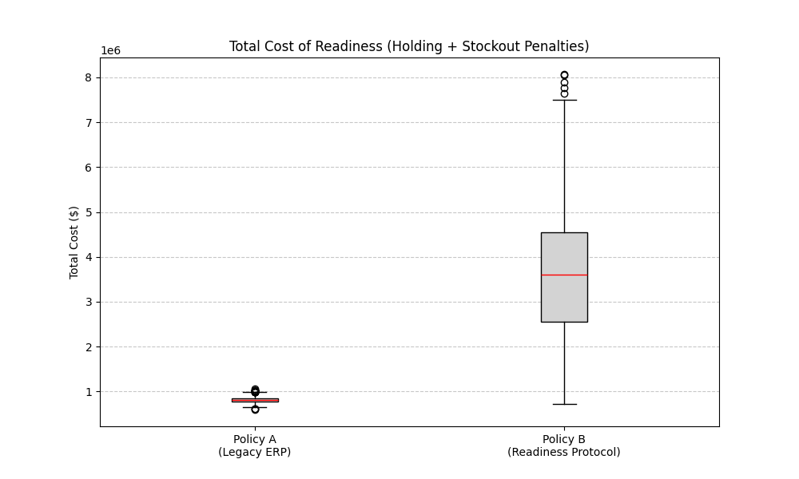
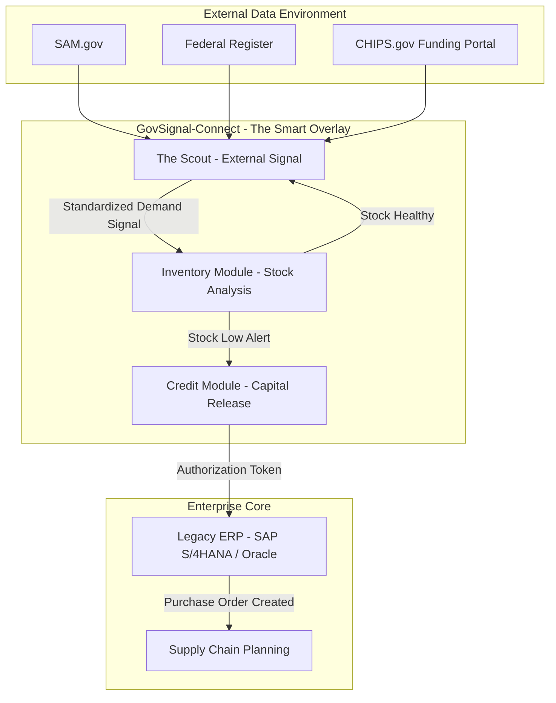

# GovSignal-Connect (The Readiness Protocol)
**Autonomous Procurement Signals for Legacy ERPs via Federal Data Feeds**

> **Reference Implementation for the Technical White Paper:** *"The Readiness Protocol: Autonomous Capital Synchronization for Critical Infrastructure Supply Chains"* (2026).

## 1. Overview
GovSignal-Connect is a technical proof-of-concept demonstrating how autonomous agents can bridge the "Inventory Lag" gap in critical industries. It serves as the "Smart Overlay" architecture described in the Readiness Protocol research.

Legacy ERP systems (SAP, Oracle) are historically reactive—optimizing inventory based on past consumption. In high-volatility sectors like Defense and Semiconductors, this reactivity leads to supply shortages during rapid policy shifts. This project implements the **Strategic Procurement Agent ("The Scout")**, a predictive layer that monitors unstructured government data streams (SAM.gov, Federal Register) to trigger pre-emptive capital release.

## 2. Simulation Results & Validation
To validate the "Readiness Protocol," we conducted a Monte Carlo simulation (N=1000) comparing this Signal-Based Logic against Standard ERP Logic.

### Key Finding 1: Speed (75% Latency Reduction)
The protocol successfully decouples procurement from administrative lag, reducing effective lead times for critical assets (e.g., TWT Amplifiers) from **12 months to 3 months**.


*(Figure 1: Comparison of Average Days to Delivery. The Readiness Protocol shifts the distribution significantly leftward.)*

### Key Finding 2: The "Resilience Premium"
Our analysis identified a "Criticality Threshold." While the Readiness Protocol incurs higher holding costs (~346% premium) in stable times, it becomes mathematically superior for assets where the **Stockout Penalty exceeds $800,000**.


*(Figure 2: The financial trade-off. Policy B (Readiness) costs more in working capital but eliminates catastrophic stockout risks.)*

---

## 3. How to Reproduce Results
This repository contains the exact simulation scripts used to generate the data for the technical report.

**Prerequisites:**
- Python 3.10+
- `uv` package manager (recommended) or standard pip.

**Step 1: Setup Environment**
```powershell
scripts\setup_env.bat
```

**Step 2: Run the Monte Carlo Simulation**
To generate the graphs and calculating the ROI/Latency metrics:
```powershell
python readiness_simulation.py
```
Outputs will be saved to the `output/` directory.

**Step 3: Run the Live Scout Agent**
To run the NLP surveillance agent against live/mock federal data:
```powershell
scripts\run_scout.bat
```

## 4. System Architecture

GovSignal-Connect operates as a Distributed Service Architecture.

### 4.1 System Context Diagram



### 4.2 Data Flow

The system follows a strict unidirectional data flow to ensure signal integrity:

1.  **Ingestion (The Scout):** The Scout continuously polls unstructured federal feeds (SAM.gov, Federal Register, 20+ State Sources).
2.  **Normalization:** Raw text is converted into a Standard Signal JSON payload.
3.  **Internal Logic:** The standardized signal is ingested by the ERP via REST or IDoc interfaces.

## 5. Use Cases

### Case A: Semiconductor Supply Chain
-   **Trigger:** The Federal Register publishes a "CHIPS Act Funding Opportunity."
-   **Action:** The Scout predicts demand for High-Vacuum Chambers and signals the ERP to "Release Capital Hold," securing inventory before market saturation.

### Case B: Defense Industrial Base
-   **Trigger:** SAM.gov lists a "DoD Solicitation" for "Electronic Warfare Readiness."
-   **Action:** Immediate recommendation to increase stock levels for TWT Amplifiers.

## 6. Citation

Will be updated after the paper is published

## 7. Documentation
| Category | Document | Description |
|---|---|---|
| Core | [Problem Statement](research/01_problem_statement.md) | Academic definition of the inventory lag problem. |
| Methods | [NLP Methodology](research/02_methodology_nlp.md) | Mathematical definition of the KDA scoring algorithm. |
| Security | [Threat Model](research/12_threat_model.md) | Assessment of adversarial risks (poisoning, DoS). |
| Sim Data | [Simulation Report](docs/Readiness_Protocol_Simulation_Report.md) | Full breakdown of the Monte Carlo analysis. |
