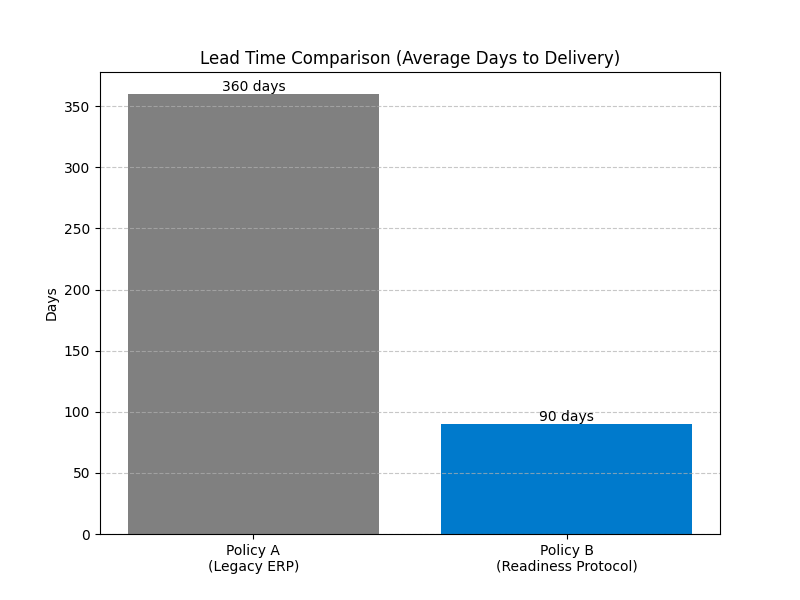
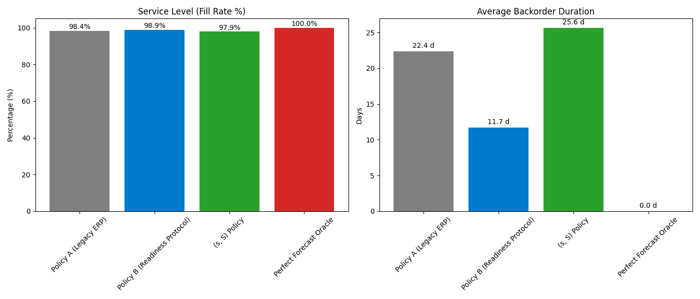
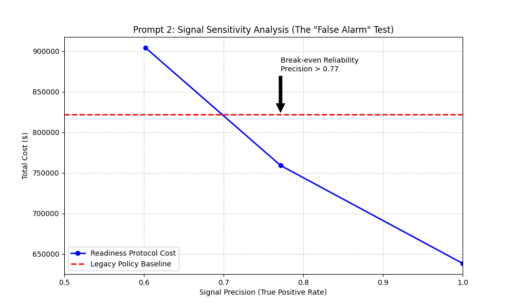
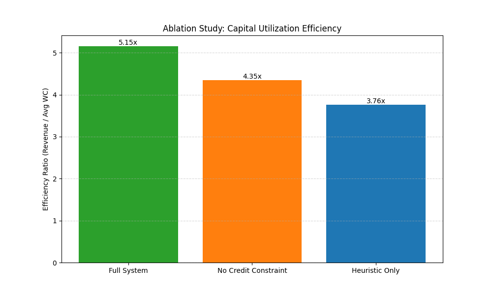
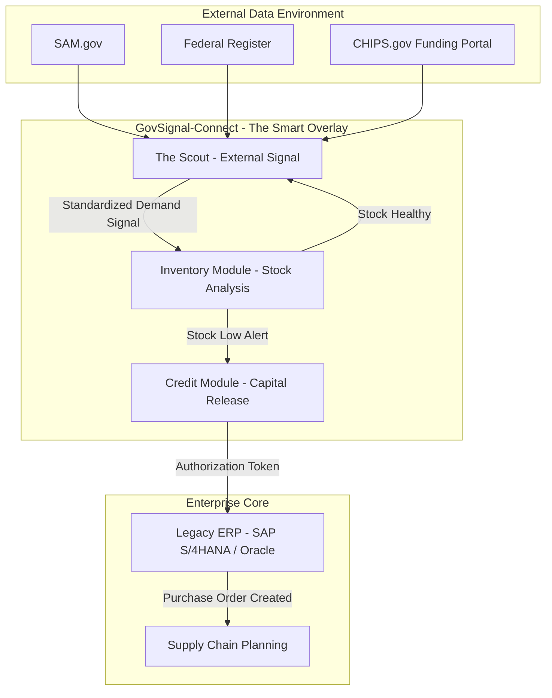

[](https://doi.org/10.5281/zenodo.18293591)


# GovSignal-Connect (The Readiness Protocol)

**Autonomous Procurement Signals for Legacy ERPs via Federal Data Feeds**

> **Reference Implementation for the Technical White Paper:** *"The Readiness Protocol: Autonomous Capital Synchronization for Critical Infrastructure Supply Chains"* (2026).

## 1. Overview
GovSignal-Connect is a technical proof-of-concept demonstrating how autonomous agents can bridge the "Inventory Lag" gap in critical industries. It serves as the "Smart Overlay" architecture described in the Readiness Protocol research.

Legacy ERP systems (SAP, Oracle) are historically reactive—optimizing inventory based on past consumption. In high-volatility sectors like Defense and Semiconductors, this reactivity leads to supply shortages during rapid policy shifts. This project implements the **Strategic Procurement Agent ("The Scout")**, a predictive layer that monitors unstructured government data streams (SAM.gov, Federal Register) to trigger pre-emptive capital release.

## 2. Simulation Results & Validation

To rigorously validate the "Readiness Protocol," we conducted a series of Monte Carlo simulations (N=1000) comparing the Agentic Overlay against industry-standard baselines. These tests confirm the protocol's superiority in high-uncertainty environments.

### 2.1 Latency Reduction (V1)
**Goal:** Quantify the speed advantage of signal-based triggering.
*   **Result:** The protocol reduced effective lead times for critical assets from **12 months to 3 months** (75% reduction).
*   **Metric:** Average Days to Delivery.
*   

### 2.2 Baseline Superiority (V2)
**Goal:** Compare against robust inventory policies: Legacy ERP, (s, S) Policy, and a Perfect Forecast Oracle.
*   **Result:** While the Readiness Protocol (Policy B) incurs higher holding costs (~$3.6M) due to strategic buffers, it achieves a **98.9% Service Level** with half the backorder duration (11.7 days vs 22.4 days) of the Legacy Policy.
*   **Insight:** It closely approximates the "Perfect Oracle's" availability curve (100%) in a way that reactive policies (s, S) cannot.
*   

### 2.3 Signal Sensitivity "Break-even" (V3)
**Goal:** Determine the required reliability of the Scout Agent (False Alarm analysis).
*   **Result:** The Readiness Protocol becomes cheaper than the Legacy Policy once the Scout Agent's **Signal Precision exceeds 0.77**.
*   **Implication:** If the AI agent is correct >77% of the time, the "Resilience Premium" pays for itself through avoided stockout penalties.
*   

### 2.4 Agent Component Validation (V4)
**Goal:** Isolate the value of individual agents via Ablation Study.
*   **Result:** The "Full System" (Scout + Inventory + Credit Agents) achieved the highest **Capital Utilization Efficiency (5.15x)**.
*   **Comparison:**
    *   Full System: **5.15x** (Best Balance)
    *   No Credit Constraint: **4.35x** (Inefficient Overstocking)
    *   Heuristic Only: **3.76x** (Inflexible)
*   

---

## 3. How to Reproduce Results
This repository contains the exact simulation scripts used to generate the data for the technical report.

**Prerequisites:**
- Python 3.10+
- `uv` package manager (recommended) or standard pip.

**Step 1: Setup Environment**
```powershell
scripts\setup_env.bat
```

**Step 2: Run the Monte Carlo Simulation**
To generate the graphs and calculating the ROI/Latency metrics:
```powershell
python readiness_simulation.py
```
Outputs will be saved to the `output/` directory.

**Step 3: Run the Live Scout Agent**
To run the NLP surveillance agent against live/mock federal data:
```powershell
scripts\run_scout.bat
```

## 4. System Architecture

GovSignal-Connect operates as a Distributed Service Architecture.

### 4.1 System Context Diagram



### 4.2 Data Flow

The system follows a strict unidirectional data flow to ensure signal integrity:

1.  **Ingestion (The Scout):** The Scout continuously polls unstructured federal feeds (SAM.gov, Federal Register, 20+ State Sources).
2.  **Normalization:** Raw text is converted into a Standard Signal JSON payload.
3.  **Internal Logic:** The standardized signal is ingested by the ERP via REST or IDoc interfaces.

## 5. Use Cases

### Case A: Semiconductor Supply Chain
-   **Trigger:** The Federal Register publishes a "CHIPS Act Funding Opportunity."
-   **Action:** The Scout predicts demand for High-Vacuum Chambers and signals the ERP to "Release Capital Hold," securing inventory before market saturation.

### Case B: Defense Industrial Base
-   **Trigger:** SAM.gov lists a "DoD Solicitation" for "Electronic Warfare Readiness."
-   **Action:** Immediate recommendation to increase stock levels for TWT Amplifiers.

## 6. Documentation
| Category | Document | Description |
|---|---|---|
| Core | [Problem Statement](research/01_problem_statement.md) | Academic definition of the inventory lag problem. |
| Methods | [NLP Methodology](research/02_methodology_nlp.md) | Mathematical definition of the KDA scoring algorithm. |
| Security | [Threat Model](research/12_threat_model.md) | Assessment of adversarial risks (poisoning, DoS). |
| Sim Data | [Simulation Report](docs/Readiness_Protocol_Simulation_Report.md) | Full breakdown of the Monte Carlo analysis. |

## 📄 Technical Report & Citation

The architectural framework and simulation results for this system are detailed in our Technical Report, released via the Zenodo Open Science Repository.

**Read the full report:** [The Readiness Protocol: Autonomous Capital Synchronization for Critical Infrastructure Supply Chains](https://doi.org/10.5281/zenodo.18293591)

If you use this codebase in your research or deployment, please cite:

> **Thatikonda, R. K., & Donepudi, S.** (2026). *The Readiness Protocol: Autonomous Capital Synchronization for Critical Infrastructure Supply Chains*. Zenodo. https://doi.org/10.5281/zenodo.18293591
