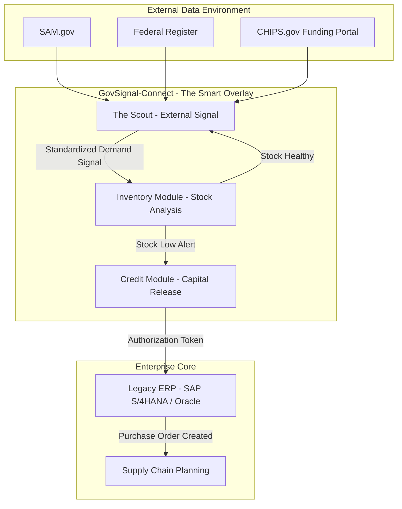

# GovSignal-Connect: Autonomous Procurement Signals for Legacy ERPs via Federal Data Feeds

**Reference Implementation for the "Smart Overlay" Architecture**

## 1. Overview
GovSignal-Connect is a technical proof-of-concept demonstrating how autonomous agents can bridge the "Inventory Lag" gap in critical industries.

Legacy ERP systems (SAP, Oracle) are historically reactive—optimizing inventory based on past consumption or committed orders. In high-volatility sectors like Defense and Semiconductors, this reactivity leads to supply shortages during rapid policy shifts (e.g., CHIPS Act funding or sudden DoD solicitations).

This "Strategic Procurement Agent" (The Scout) acts as a predictive layer. It continuously monitors unstructured government data streams (SAM.gov, Federal Register), normalizes them into structured "Signals," and feeds them into legacy ERPs to trigger pre-emptive capital release.

## 2. Use Cases

This prototype demonstrates two specific high-value scenarios:

### Case A: Semiconductor Supply Chain
- **Trigger**: The Federal Register publishes a "CHIPS Act Funding Opportunity" for domestic nanofabrication.
- **Signal**: The Scout detects the grant, correlates it with "Nanofabrication," and predicts a demand spike for specific assets.
- **Action**: A signal is sent to the ERP to "Release Capital Hold" for **High-Vacuum Chambers**, securing long-lead inventory before market saturation.

### Case B: Defense Industrial Base
- **Trigger**: SAM.gov lists a "DoD Solicitation" for "Electronic Warfare Readiness."
- **Signal**: The Scout identifies "Jamming Pods" requirements.
- **Action**: Immediate recommendation to increase stock levels for **TWT (Traveling Wave Tube) Amplifiers**, a critical sub-component for EW systems.

## 3. System Architecture

GovSignal-Connect operates as a Distributed Service Architecture. The "Procurement Scout" is the primary external sensor, but it acts in concert with internal modules to execute the full "Smart Overlay" strategy.

### 3.1 System Context Diagram



### 3.2 Data Flow
The system follows a strict unidirectional data flow to ensure signal integrity:

1.  **Ingestion (The Scout):** The Scout continuously polls unstructured federal feeds. It filters noise using the `critical_asset_ontology`.
2.  **Normalization (External Signal):** Raw text is converted into a `Standard Signal` JSON payload. This isolates the legacy ERP from the chaos of unstructured government data.
3.  **Internal Logic (ERP):** The standardized signal is ingested by the ERP via REST or IDoc interfaces. The ERP handles the "Internal Logic" (e.g., checking specific warehouse bin levels, calculating lead times based on preferred vendors).

### 3.3 Auditability & Compliance
To meet requirements for **ITAR (International Traffic in Arms Regulations)** and **FDA (Food and Drug Administration)** validations, the system enforces strict audit trails:

-   **Decision Logging:** Every "Demand Probability" score is logged with its timestamp and source snippet.
-   **Immutable Records:** Actionable signals sent to the ERP (`release_capital_hold`) are hashed and stored to provide a tamper-evident record of *why* automated purchasing decisions were made.
-   **Human-in-the-Loop:** For signals with a confidence score between 0.5 and 0.8 (`flag_for_review`), the Credit Agent requires a human digital signature before releasing funds.

### 3.4 Source Coverage (New!)
In addition to **SAM.gov** and **Federal Register**, the Scout now monitors **20+ State & Local** sources for deeper supply chain signals:
- **State Economic Development:** CA (GO-Biz), TX (TEF), NY (ESD), AZ (ACA), OH (Development), GA, MI, IN, PA, WA.
- **Municipal & Regional:** Austin, Boston, Huntsville, Port Authority NY/NJ.
- **Specialized/Non-Profit:** Mass Life Sciences, NC Biotech, Florida Defense Task Force, NGA, CSG, Virginia EDP.

## 4. Research Specifications & Documentation

This project maintains a rigorous documentation standard to satisfy audit and compliance requirements.

| Category | Document | Description |
|----------|----------|-------------|
| **Core** | [Problem Statement](research/01_problem_statement.md) | Academic definition of the inventory lag problem. |
| **Methods** | [NLP Methodology](research/02_methodology_nlp.md) | Mathematical definition of the KDA scoring algorithm. |
| **Security** | [Threat Model](research/12_threat_model.md) | Assessment of adversarial risks (poisoning, DoS). |
| **Compliance** | [Regulatory Framework](research/11_regulatory_compliance.md) | Adherence to NIST SP 800-171 and SOX. |
| **Integration** | [API Spec (OpenAPI)](research/04_api_specifications.yaml) | Standardized interface for ERP ingestion. |
| **Roadmap** | [Future Roadmap](research/08_future_roadmap.md) | Planned evolution to Semantic RAG and Autonomous Negotiation. |

> **Note:** Full documentation including [Scalability Reports](research/10_scalability_report.md) and [Audit Processes](research/13_audit_process.md) can be found in the [`research/`](research/) directory.

## 5. Technical Implementation

This repository contains:
- `govsignal/scout.py`: The core agent implementing the surveillance loop and [advanced NLP demand probability scoring](research/02_methodology_nlp.md).
- `govsignal/connectors.py`: Mock adapters for federal APIs (simulating API responses for demonstration).
- `tests/`: Comprehensive test suite covering unit logic, 20+ local connectors, and integration cycles.
- `examples/config.yaml`: Configuration defining the surveillance targets and keyword ontologies.

### Running the Prototype

**Prerequisites:**
- Python 3.10+
- `uv` package manager (recommended) or standard pip.

**Setup:**
1. Initialize the environment:
   ```powershell
   setup_env.bat
   ```

**Execution:**
1. Run the Scout agent:
   ```powershell
   run_scout.bat
   ```
2. Observe the JSON output in the console, simulating the API payload sent to an ERP integration endpoint.
